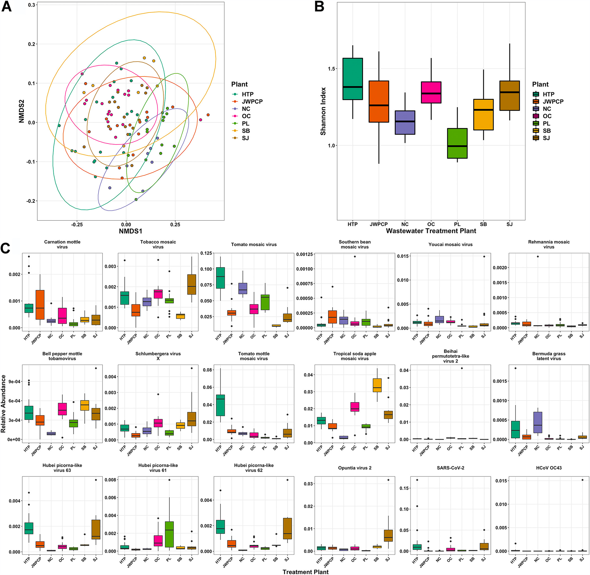

#you can set knitr option for each individual chunk. Might be good to
remove output of certain chunks. e.g. message = TRUE and warning = FALSE

```{r setup, include=FALSE}
knitr::opts_chunk$set(
  echo = TRUE,
  cache = TRUE,
  autodep = TRUE,
  cache.comments = FALSE,
  dpi = 300
)
```

# Background

Here I will analyze initial Illumina runs which were submitted in
October 2022.

We will work with [.biom files](https://biom-format.org/), acquired from
a CZID analysis of our data (link
[here](https://czid.org/my_data?currentDisplay=table&currentTab=samples&mapSidebarTab=summary&projectId=4788&showFilters=true&showStats=true&updatedAt=2022-10-07T18%3A28%3A46.867Z&workflow=short-read-mngs),
only available when given access. Reach out to simon\@securebio.org if
you do not have access)

# Introduction

### R packages

We start by loading all required R packages:

```{r}
# set of data analysis and viz tools
library(tidyverse)

# file system helpers
library(fs)

# specifying locations within a project
library(here)

# microbiome analysis helpers
library(biomformat)
library(speedyseq)

# plotting helpers
library(cowplot)
library(patchwork)
library(ggbeeswarm)

theme_set(theme_cowplot())
```

We then set the folder containing the `.biom` file as our `here`
directory.

```{r}
illumina_data_path <- here("data")
dir_ls(illumina_data_path) %>% path_file
```

### Data import

We now import the BIOM file (Combined Microbiome File.biom)

```{r, error = TRUE, eval = FALSE}
biom <- path(illumina_data_path, '2022_11_14_Illumina_pilot_nt_r.biom') %>%
  read_biom()
```

Note, if we try reading in the file as directly exported from CZID, we
get an error:

    Error in validObject(.Object) :
      invalid class “biom” object: type field has unsupported value

This error arises because the 'type' of the data object defined in the
JSON-formatted contents of the `.biom` file isn't valid as per the BIOM
format v1.0 specs, see
<https://biom-format.org/documentation/format_versions/biom-1.0.html>.

We can see this by opening up the file and looking for the type argument
towards the beginning; or looking at the top items in the list after
reading in the file with a JSON parser.

```{r}
biom_json <- path(illumina_data_path,
  '2022_11_14_Illumina_pilot_nt_r.biom') %>%
  jsonlite::read_json()
biom_json %>% head(9)
```

We can fix the file by changing the type from 'Table' to something
valid. It doesn't actually matter what we use:

> While type is a required entry in BIOM tables, the BIOM format itself
> does not change for different data types (e.g., OTU Table, function
> table, metabolite table). This information is included to allow tools
> that use BIOM files to determine the data type, if desired. (Caption
> for Additional file 5 in @mcdonald2012theb)

<https://academic.oup.com/gigascience/article/1/1/2047-217X-1-7/2656152>

For now, let's use 'Taxon table'.

```{r}
biom_text <- path(illumina_data_path, '2022_11_14_Illumina_pilot_nt_r.biom') %>%
  read_file
stopifnot( identical(biom_text %>% str_count('"Table"'), 1L) )
biom_text_fixed <- biom_text %>%
  str_replace('"Table"', '"Taxon table"')
write_file(
  biom_text_fixed,
  path(illumina_data_path, '2022_11_14_Illumina_pilot_nt_r_fixed.biom')
)

```

The above chunk reads in the BIOM file's contents as a single string,
checks that '"Table"' appears only once (in the field where it is set as
the type), then replaces it with '"Taxon table"'), then writes the
string as a new BIOM file. We should now be able to load the corrected
BIOM file with the biomformat package,

```{r}
biom <- path(illumina_data_path, '2022_11_14_Illumina_pilot_nt_r_fixed.biom') %>% read_biom() %>%
  print
```

Note: For most objects in R, the `print()` and `glimpse()` methods
silently return the object as well as printing information about it.
Adding a `print` or `glimpse` call at the end of a variable-assignment
pipe chain is a succinct way to save an object and show some info about
it.

### Creating a phyloseq object

The abundance (count) matrix, sample metadata table, and taxonomy table
can be extracted with three corresponding functions functions from the
biomformat package.

We'll tackle these one at a time. First, the abundance matrix.

#### Abundance matrix

```{r}
abun <- biom %>% biom_data()
abun %>% class
abun %>% dim
```

The abundance matrix is stored as a sparse matrix from the Matrix
package. That is fine for now, though phyloseq will want a standard
(dense) matrix. Next we will extract the sample metadata.

#### Sample Metadata

```{r}
sam <- biom %>% sample_metadata()
sam %>% class
sam %>% head
sam %>% glimpse
```

The sample metadata is a standard data frame with rownames giving sample
ids, and the taxonomy information is stored as a list. Notice how all
the variable names are in snake case except for one. This is apparently
because the CZID BIOM exports its own standard variables as snake case
(though shows them otherwise in the online interface), but leaves custom
variables unchanged. **It is convenient to standardize all variable
names to snake case**; an easy way to do this is with the function
`janitor::clean_names()`.

```{r}
sam <- sam %>%
  janitor::clean_names() %>%
  glimpse
```

Next, the taxonomy table, or what the biomformat package calls the
'observation metadata'.

#### Taxonomy table

Note, when using glimpse we observe that taxonomy level 2 (under
'Bacteria') is blank. Might be worth investigating why that is.

```{r}
tax <- biom %>% observation_metadata()
tax %>% class
tax %>% head(2)
tax %>% glimpse()
```

```{r}
?biomformat::observation_metadata
```

We can see that here we have a list, with one element per taxon. The
documentation for `biomformat::observation_metadata` indicates that this
function may return a 'data.frame' rather than a list, if it is able to,
but does not say under what conditions that will be the case. Ultimately
we want a data frame (or tibble). The following code chunk checks which
we have, and if we have a list, tries to turn it into a data frame by
spreading out the taxonomy vector of each list element into a table.

```{r}
tax_tmp <- biom %>% observation_metadata()
if (is.data.frame(tax_tmp)) {
  tax <- tax_tmp %>% as_tibble(rownames = '.otu')
} else {
  tax <- tax_tmp %>%
    enframe(name = 'feature_id') %>%
    unnest_wider(value)
}
rm(tax_tmp)
tax %>% glimpse
```

To understand this table further, we can first look at the first column.
This contains the entire taxonomic structure of one organism in one
variable, like so:

`Bacteria;NA;Proteobacteria;Alphaproteobacteria;Rhizobiales;Xanthobacteraceae;Azorhizobium;Azorhizobium caulinodan`

The following columns then show all the taxonomic information broken
down by different taxa levels:

```{r}
glimpse(as_tibble(tax[1:3, 2:9]))
```

To facilitate downstream analysis, it is helpful to so some cleanup:

-   Replace the taxonomic ranks with the standard NCBI rank names (see
    an example [NCBI taxonomic
    record](https://www.ncbi.nlm.nih.gov/Taxonomy/Browser/wwwtax.cgi?id=9606))
-   In cases where the rank is missing/unassigned, replace the empty
    string with NA <!--  -->

```{r}
rnks <- c('superkingdom', 'kingdom', 'phylum', 'class', 'order', 'family',
  'genus', 'species')
colnames(tax)[2:9] <- rnks
# use NA for missing ranks
tax <- tax %>%
  mutate(
    across(everything(), ~ifelse(. == "", NA_character_, .))
  )
tax %>% glimpse
```

Now let's import all three tables into a single `phyloseq` object. This
involves converting each individual table into the corresponding class
from the `phyloseq` package, and then combining these into one
phyloseq-class object.

```{r}
ps <- phyloseq(
  otu_table(abun %>% as.matrix, taxa_are_rows = TRUE),
  sample_data(sam),
  tax_table(tax)
)
```

Note that we had to first coerce the abundance matrix to a standard
dense matrix; we also needed to tell phyloseq that taxa corresponded to
rows in the matrix.

# Basic data checks and stats

(Comments from here on out are by Simon)

Our `phyloseq` object consists of several tables, one of which is our
sample metadata:

```{r}
ps %>% sample_data() %>% glimpse
```

Understanding how many individual species are covered by each sample
gives us an initial large scale picture of how samples differ. We can
thus add a column for our sample metadata consisting of the sum of all
individual species:

```{r}
ps <- ps %>%
  mutate_sample_data(.,
    sample_sum = sample_sums(.)
  )
sam <- ps %>% sample_data %>% as_tibble
tax <- ps %>% tax_table %>% as_tibble
```

It will also be interesting to compare groups of samples by their
experimental protocols. For this, we can add a column to our sample
metadata, consisting of experimental classes:

!!! Make experiment class assignments robust.

```{r}
experiment_class <- c("peg_preciptation", "peg_preciptation", "ceres", 
                         "peg_preciptation", "ceres", "ceres", "amicon", 
                         "peg_preciptation", "amicon", "ceres", "amicon", "amicon")

ps <- ps %>% 
  mutate_sample_data(
    experiment_class = experiment_class)
```

```{r}
ps %>% t

```

As visible in the crude table below, there are multiple samples with
very small species amounts, while other samples contain more than
150'000 individual species. The samples with very low species counts are
controls (A-C, CU-C, PC) and the CERES filtered sample.

```{r}
sam %>%
  ggplot(aes(sample_sum, fill = experiment_class)) +
  scale_x_log10() +
  geom_histogram()

sam %>%
  ggplot(aes(sample_sum, fill = experiment_type)) +
  scale_x_log10() +
  geom_histogram()
```

```{r}
?fct_explicit_na
```

**QUESTION:** Can we walk through the code below?

```{r}
taxon_stats <- ps %>%
  as_tibble %>%
  mutate(across(superkingdom, fct_explicit_na)) %>%
  with_groups(c(.otu, superkingdom), summarize,
    prev_1 = sum(.abundance >= 1),
    prev_10 = sum(.abundance >= 10),
    total = sum(.abundance),
    proportion = mean(.abundance / sample_sum)
  )
```

```{r}
taxon_stats %>%
  pivot_longer(-c(.otu, superkingdom)) %>%
  ggplot(aes(value, fill = superkingdom)) +
  facet_wrap(~name, scales = 'free') +
  scale_x_log10() +
  scale_fill_brewer(type = 'qual') +
  geom_histogram()
```

## Taxonomy

NCBI taxonomy has recently received changes in some prokaryotic phylum
names. Let's check to see which version of phylum names are being used
here, by seeing whether a Bacteroides species' phylum is listed as
'Bacteroidetes' (old name) or 'Bacteroidota' (new name).

```{r}
tax %>%
  filter(genus == 'Bacteroides') %>%
  slice(1)%>%
  glimpse
```

If we look at [this taxon in NCBI
taxonomy](https://www.ncbi.nlm.nih.gov/Taxonomy/Browser/wwwtax.cgi?id=1263047),
we can see that NCBI has adopted the new phylum name 'Bacteroidota';
however, here we see the old phylum name. This suggests that CZID is
currently using an older version of NCBI prior to the name change.

see -
<https://ncbiinsights.ncbi.nlm.nih.gov/2021/12/10/ncbi-taxonomy-prokaryote-phyla-added/> -
<https://www.the-scientist.com/news-opinion/newly-renamed-prokaryote-phyla-cause-uproar-69578>
<!--  -->

We can now also look at the fraction of each taxa level which is
classified. In total there are 12447 classified species:

```{r}
tax %>%
  pivot_longer(-.otu, names_to = 'rank') %>%
  with_groups(rank, summarize,
    features_classified = sum(!is.na(value)),
    features_total = n()
  ) %>%
  mutate(
    frac_classified = features_classified / features_total,
    rank = factor(rank, rank_names(ps))
  ) %>%
  arrange(rank)
```

This analysis points to some notable features of the data. For example,
not every taxonomic feature has a superkingdom. Let's take a look at
some of those 'species' that don't:

```{r}
set.seed(42)
tax %>%
  filter(is.na(superkingdom)) %>%
  select(superkingdom, kingdom, genus, species) %>%
  slice_sample(n=20)
```

As we see, there are some sequences that are classified as cloning and
expression vectors.

What about 'species' without intermediate ranks?

```{r}
tax %>%
  filter(!is.na(superkingdom), is.na(family)) %>%
  select(superkingdom, kingdom, phylum, family, genus, species) %>%
  slice_sample(n=20)
```

Different than before these sequences seem to match NCBI records that
aren't well annotated (e.g., "Uncultured Bacterium")

Lastly we can look at how species break down by superkingdom:

```{r}
tax %>%
  count(superkingdom) %>%
  mutate(fraction = n / sum(n))
```

# Analysis

## Taxonomic composition overview

**QUESTION:** What would be most useful here?

Look at the methods used in this paper by Hjelmso et al to find out
which analyses they have done:
<https://journals.plos.org/plosone/article?id=10.1371/journal.pone.0170199#sec002>

### **Relative abundances of superkingdoms**

What do I want to compare here? At the end of the day I want to
agglomerate taxa data on the superkingdom level, for which I can use
`glom`.

I could then plot samples, displaying their relative shares of Viruses,
Bacteria, Archea, and Eukaryotes.

First, calculate abundance sums for each sample

```{r}
abun_subset_ps <- ps %>%
  filter_sample_data(sample_sum > 1e3) %>% 
  filter_taxa2(~ sum(. > 0) > 2 & sum(.) >= 10) 

total_sums <- abun_subset_ps %>% 
  sample_sums(.)

bacteria_sums <- abun_subset_ps %>% 
  filter_tax_table(superkingdom == 'Bacteria') %>%
  sample_sums(.)

virus_sums <- abun_subset_ps %>% 
  filter_tax_table(superkingdom == 'Viruses') %>%
  sample_sums(.)

archaea_sums <- abun_subset_ps %>% 
  filter_tax_table(superkingdom == 'Archaea') %>%
  sample_sums(.)

eukaryota_sums <- abun_subset_ps %>% 
  filter_tax_table(superkingdom == 'Eukaryota') %>%
  sample_sums(.)
```

```{r}

rownames <- c("total_sums", "bacteria_sums", "virus_sums", "archaea_sums", "eukaryota_sums")

superkingdom_absolute_abun <- bind_rows(total_sums, 
                                        bacteria_sums, 
                                        virus_sums, 
                                        archaea_sums, 
                                        eukaryota_sums, 
                                        .id = "sum_type") %>% 
  mutate(sum_type = rownames)

superkingdom_absolute_abun
```

**QUESTION:** How to create [this
plot](https://r4ds.had.co.nz/data-visualisation.html#creating-a-ggplot:~:text=position%20%3D%20%22fill%22%20works%20like%20stacking%2C%20but%20makes%20each%20set%20of%20stacked%20bars%20the%20same%20height.%20This%20makes%20it%20easier%20to%20compare%20proportions%20across%20groups.)
using the following tibble:

```{r}
superkingdom_plot <- superkingdom_absolute_abun %>% 
  pivot_longer(-sum_type, names_to = "sample_name", values_to = "count")

superkingdom_plot

ggplot(data = superkingdom_plot) +
  geom_bar(mapping = aes(x=sample_name, fill=count), position = "fill")
          
```

Pseudocode:

    abun_subset_ps <- ps %>%
      filter_sample_data(sample_sum > 1e3) %>% 
      filter_taxa2(~ sum(. > 0) > 2 & sum(.) >= 10) 
      
    abun_subset_ps %>%
      filter_tax_table(superkingdom == 'Bacteria') %>%
      

### Superkingdom relative abundances (ratios and proportions)

-   \% of assigned reads (and host-filtered reads)

    -   Should be easily doable with CZID csvs

-   Compare 'nt' and 'nr' results

-   Show how many reads do not have a full taxonomic analysis

-   Of what remains, what is each sequence

-   Different types of ordination

    -   CPCA -\> do that on super kingdom analysis

-   Next week start writing a report to hand out to everyo

-   Compare neg controls to other samples (ordination/distances,
    decontam analysis)

## Recreating the Rothman et al 2021 Figure 4 using Illumina data

Rothman Figure 4: ([source of
paper](https://journals.asm.org/doi/full/10.1128/AEM.01448-21); [source
of R
code](https://github.com/jasonarothman/wastewater_viromics_sarscov2/tree/main/github_R_scripts))



### Filtering our samples

Prep: Note, it is often helpful to filter out some samples and taxa
prior to doing some downstream analysis.

-   First we remove all samples with very low read counts, here defined
    as under 1000 reads. We would thus exclude all controls and the
    Ceres filtered sample.

```{r}
ps %>% filter_sample_data(sample_sum < 1e3) %>% sample_data %>% .[["experiment_type"]]
```

-   We also want to subset to just viruses for now (the Rothman analysis
    also only considers viruses)
-   Furthermore we'd like to remove species with under 10 reads, and
    those occurring in fewer than 2 samples, which will speed up
    calculations and likely make our results more meaningful since these
    identifications can easily be spurious.
    -   Note that this would lead to the inclusion of samples that have
        zero (!) reads, as some of the control samples only have 2 reads
        per species.

```{r}
ps_subset <- ps %>%
  filter_sample_data(sample_sum > 1e3) %>% 
  filter_tax_table(superkingdom == 'Viruses') %>%
  filter_taxa2(~ sum(. > 0) > 2 & sum(.) >= 10)
```

Using this subfilter, `ps_subset` only includes

```{r}
ntaxa(ps_subset)
```

taxa, while `ps` includes

```{r}
ntaxa(ps) 
```

taxa.

### Bray-Curtis NMDS ordination (Panel A)

#### Background

There are many ways to do this; here I'll use the `ordinate()` and
`plot_ordination()` helper function from phyloseq to create the NMDS
plot using the Bray-Curtis community dissimilarity metric.

NMDS stands for *non-metric multidimensional scaling.* The *non-metric*
part is important, as NDMS takes into account the rank-order of
different species across different samples, not the absolute or relative
differences in abundance of different species. A good explanation of
NMDS can be found
[here](https://jonlefcheck.net/2012/10/24/nmds-tutorial-in-r).

Still it is important to manually normalize the abundances to have the
same total in each sample (e.g. by normalizing to proportions, as done
here), otherwise the different total counts across samples will affect
the results.

#### Code

```{r}
nmds <- ps_subset %>%     
  speedyseq::transform_sample_counts(~ . / sum(.)) %>%     
  ordinate(method = "NMDS", distance = "bray", trymax = 50) 
ps_subset_ord <- plot_ordination(ps_subset, nmds,   color = "experiment_type", type = "samples", label = "experiment_class") +   
  labs(color = 'experiment_type') 
ps_subset_ord
```

### Alpha diversity (Panel B)

#### Interlude on diversities and effective species numbers

We can now compute Shannon alpha diversity index for each sample. The
Shannon alpha diversity index is one of many ways to represent the
diversity of a sample. One can understand it as the level of surprise
when sampling random inividuals from a population. Holding the number of
species constand, one is maximally surprised if all species have the
same relative proportions. Similarly, one is more surprised if the
number of different species present is higher.

Diversity indices have one important attribute, that make their
interpretation trickier than expected. Intuitively, one would expect
that the diversity of a sample with 100 different, equally abundant
species would be half as big as the diversity of a sample with 200
different, equally abundant species. Let's take a closer look at this
below (code taken from this [blog
post](https://jonlefcheck.net/2012/10/23/diversity-as-effective-numbers/))

**QUESTION:** Why the `;` after certain commands?

```{r}
community1=data.frame(t(rep(1,100))); colnames(community1)=paste("sp",1:100)
community2=data.frame(t(rep(1,200))); colnames(community2)=paste("sp",1:200)

S1=specnumber(community1); S1
S2=specnumber(community2); S2
S1==0.5*S2
```

As predicted, in these two communities, the species number of
`community1` is exactly half that of `community2`

Now, is the relation of Shannon diversities the same?

```{r}
H1=diversity(community1,index="shannon"); H1
H2=diversity(community2,index="shannon"); H2

H1==0.5*H2
```

It is not!

We can explore this question further by plotting the different levels of
Shannon diversity for communities of different sizes:

```{r}
shannon=matrix(ncol=2,nrow=1000)
for(i in 1:1000) {
  community=data.frame(t(rep(1,i))); colnames(community)=paste("sp",1:i)
  shannon[i,1]=i
  shannon[i,2]=diversity(community,index="shannon") }

plot(shannon[,1],shannon[,2],xlab="Species Richness",ylab="Shannon Diversity",
main="Relationship between Shannon diversity and Species Richness")
```

The paper "Entropy and diversity" by Jost L. (2006)
([source](https://onlinelibrary.wiley.com/doi/epdf/10.1111/j.2006.0030-1299.14714.x))
explores this further and gives an account of how to convert different
Shannon diversities into "effective number of species", which provide a
more intuitive account of a population's diversity.

Getting to this effective number is very easy, by taking the exponential
function (i.e. $$e^x$$) of the Shannon diversity, like so:

```{r}
#First, let's create a population with 100 equally abundant species
community1=data.frame(t(rep(1,100))); colnames(community1)=paste("sp",1:100)

#Then, let's compute the Shannon diversity H1 and the species number S1
H1=diversity(community1,index="shannon"); H1
S1=specnumber(community1); S1

H1
exp(H1)
S1
H1 == S1

#Finally, let's exponentiate the Shannon diversity, again comparing it to S1. 
round(exp(H1)) == S1
```

We had to round H1, as the results of certain types arithemtic are to
truly identical to a direct representation of the known answer. More on
this
[here](https://cran.r-project.org/doc/FAQ/R-FAQ.html#Why-doesn_0027t-R-think-these-numbers-are-equal_003f).

To tie all of this together, here the same graph as above, but with all
Shannon diversities exponentiated.

```{r}

shannon=matrix(ncol=2,nrow=1000)
for(i in 1:1000) {
  community=data.frame(t(rep(1,i))); colnames(community)=paste("sp",1:i)
  shannon[i,1]=i
  shannon[i,2]=exp(diversity(community,index="shannon")) }

plot(shannon[,1],shannon[,2],xlab="Species Richness",ylab="Effective Numbers of Species",main="Shannon (Effective)")
```

####  Code

Going back to our data, we can calculate alpha diversity in a variety of
ways:

-   `phyloseq::estimate_richness()`
-   `vegan::diversity()`

```{r}
shannon_index <- otu_table(ps_subset) %>%
  orient_taxa(as = 'cols') %>%
  vegan::diversity()
shannon_index %>% head

```

Note that we needed to reorient the abundance matrix (i.e. OTU table) to
have taxa corresponding to columns, as this is what functions in the
vegan package expect. We can tell that we used the correct orientation
because the resulting diversity values are in a named vector where the
names correspond to the sample names. If we had passed the matrix in the
incorrect orientation, then the vector names would be the taxa names.

Now we can add add the Shannon index to our sample data.

```{r}
ps_subset <- ps_subset %>% 
  speedyseq::mutate_sample_data(
    shannon_index = shannon_index)
```

then create the plot, using the effective number of species, by
exponentiating the Shannon index

```{r}
p_div <- ps_subset %>% 
  sample_data %>% 
  ggplot(aes(y = exp(shannon_index), x = experiment_class,
      color = experiment_class)) +
  geom_boxplot(outlier.shape = NA) +
  geom_quasirandom() +
  expand_limits(y = c(0,160)) +
  labs(x = 'Experiment Class', y = 'Effective Number of Viral Species') +
  theme(
    axis.text.x = element_text(angle = 45, vjust = 1, hjust = 1),
    legend.position = 'none'
  )
p_div
```

**QUESTION:** How to create the same plot as above, but plotting the
absolute number of species present in each sample?

```{r}
ps_subset %>% 
  as_tibble %>% 
  with_groups(.sample, ntaxa)
```

Note, I'm plotting the data points over the box plots, since it is
useful to see the scatter when we're working with a relatively small
number of points like this.

Note, I suggest using the exponential of the Shannon index and plotting
on a log scale), so that the numbers shown on the axis are in terms of
effective number of species.

Now we can also redo our ordination, labeling by 'experiment_class'.

```{r}
nmds <- ps_subset %>%     
  speedyseq::transform_sample_counts(~ . / sum(.)) %>%     
  ordinate(method = "NMDS", distance = "bray", trymax = 50) 
p_ord <- plot_ordination(ps_subset, nmds,   
                         color = "experiment_class", type = "samples" ) +
  labs(color = 'experiment_class')
p_ord
```

### Relative abundances (Proportions) (Panel C)

In the actual Rothman figure, the abundances for a set of viruses are
shown; the particular viruses were picked based on an analysis to
determine viruses that vary across treatment plant, using the ANCOM R
package. I may do that in a future version of this script, but for now
I'll just pick the 10 most abundant viruses by average proportion.

First, get a data frame for plotting, with the proportions of all taxa
alongside the original read counts,

```{r}
x <- ps_subset %>%
  as_tibble %>%
  with_groups(.sample, mutate,
    proportion = .abundance / sum(.abundance))
```

Next, get the top 10 viruses by median proportion. We can do this
various ways, e.g.

```{r}
top_viruses1 <- ps_subset %>%
  speedyseq::transform_sample_counts(~ . / sum(.)) %>%
  orient_taxa(as = 'rows') %>%
  otu_table %>%
  apply(1, median) %>%
  sort(decreasing = TRUE) %>%
  head(10) %>%
  names

top_viruses1
```

We can also try an alternative approach which produces similar results

```{r}
top_viruses2 <- x %>%
  with_groups(.otu, summarize, across(proportion, median)) %>%
  slice_max(proportion, n = 10) %>%
  print %>%
  pull(.otu)
identical(top_viruses1, top_viruses2)
```

Finally, if we use the top_viruses2 results in the table below we get
the following table.

**QUESTION:** What is the underlying error here?

```{r, fig.dim = c(10,5)}
p_prop <- x %>%
  filter(.otu %in% top_viruses2) %>%
  mutate(
    across(genus, fct_reorder, proportion, .fun = median, .desc = TRUE),
  ) %>%
  ggplot(aes(x = experiment_type, y = proportion,
      color = experiment_class)) +
  facet_wrap(~genus, nrow = 2, scales = 'free_y') +
  scale_y_log10() +
  geom_boxplot() +
  geom_jitter() +
  labs(y = 'Proportion', x = 'experiment_type') +
  theme(
    axis.text.x = element_text(angle = 45, vjust = 1, hjust = 1),
    legend.position = 'none'
  )

p_prop
```

### Put the panels together

Putting multiple panels together is often very easy with the patchwork
package loaded,

```{r, fig.dim = c(10,10)}
(p_ord + p_div) / p_prop +
  plot_annotation(tag_levels = 'A')
```

This plot could definitely benefit from some extra fiddling, to adjust
the spacing and colors etc.
