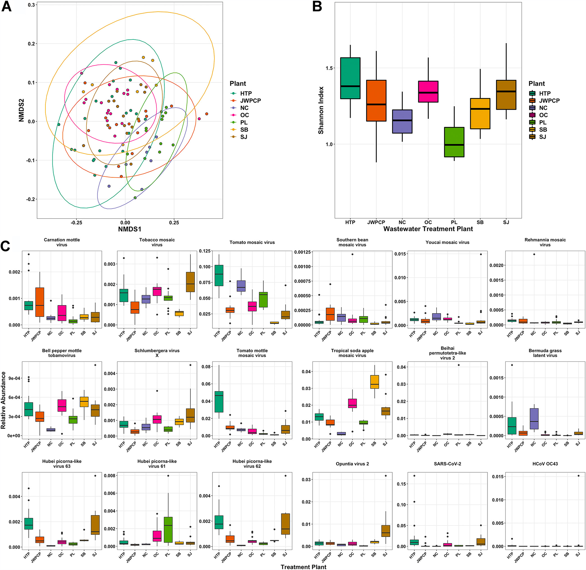
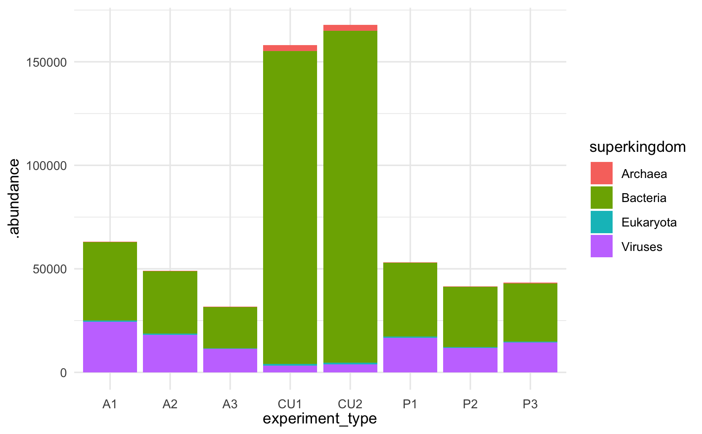

```{r setup, include=FALSE}
knitr::opts_chunk$set(
  echo = TRUE,
  warning = FALSE,
  cache = TRUE,
  warning=FALSE,
  code_folding = TRUE,
  autodep = TRUE,
  cache.comments = FALSE,
  dpi = 300
)
```

# Analysis

## TODOS:

### Fixes

-   Turn pipeline plot into line plot, without faceting

-   Fix labeling issues

-   Use factors to change order in categorical data - relevant for
    sorting bar plots along different categories, such as
    `experiment_class`

    -   Refer to these links: [forcats
        package](https://forcats.tidyverse.org/), [R for Data Science -
        Factors](https://r4ds.had.co.nz/factors.html#modifying-factor-order)

-   Drop the step of calculating abundances in an arduous way, instead
    working with tax_glom

-   Fix `top_viruses1` code. The resulting table doesn't look right,
    hence I'd like to fix this.

-   Discuss with Mike about "`experiment_type` not being a useful var
    since every sample has a different value"

### Additions

-   Show how many reads do not have a full taxonomic analysis

    \- Of what remains, what is each sequence

-   Do further types of ordination

    -   CPCA (?) -\> do that on super kingdom analysis

-   Compare neg controls to other samples (ordination/distances,

## Setup

### R packages

Loading our required R packages.

```{r}
# set of data analysis and viz tools
library(tidyverse)

# file system helpers
library(fs)

# specifying locations within a project
library(here)

#Fastqc & Multiqc helpers
library(TidyMultiqc)

# microbiome analysis helpers
library(biomformat)
library(speedyseq)
library(vegan)

# plotting helpers
library(cowplot)
library(patchwork)
library(ggbeeswarm)
```

### Defining directories

```{r}
biom_data_path <- here("data")
multiqc_data_path <- here("data/fastqc_analyses/multiqc_reports/multiqc_data")
metadata_data_path <- here("metadata")
output_data_path <- here("output")
```

### Loading our data

```{r}
ps <- readRDS(here(output_data_path, "2022_12_08_illumina_phyloseq.Rds"))

sample_pipeline <- read.csv (path(biom_data_path, "2022_12_01_czid_sample_overview.csv"),
                             header = TRUE)
```

## Assessing CZID pipeline

Our goal here is to analyze our 12 samples in more detail. For this, we
first need to understand how CZID arrived at the samples we are using
here. For this, we can display how many sequences made it through the
various steps of the CZID pipeline. For this we again subsample to
larger samples (reads \>1000). We can also add information about the
experiment class and the total number of assigned reads (`total_reads`)

```{r}
sample_pipeline_subset <- sample_pipeline %>%
  filter(total_reads > 1e4)

ps_sample_type_and_sum <- ps %>% 
  sample_data() %>% 
  as_tibble() %>% 
  select(experiment_type, experiment_class, sample_sum)

sample_pipeline_subset <- sample_pipeline_subset %>% 
  left_join(.,ps_sample_type_and_sum, 
            by = c("Experiment.Type" = "experiment_type"), 
            copy = TRUE)
```

After adding metadata to our `sample_pipeline_subset` table, we can now
take a closer look at the various steps in the CZID pipeline.

```{r}
#Subsetting dataframe for visualization

pipeline <- sample_pipeline_subset %>% 
  select(sample_name,
         experiment_class,
         total_reads, 
         reads_after_star, 
         reads_after_trimmomatic,
         reads_after_priceseq, 
         reads_after_czid_dedup, 
         sample_sum,sample_name)

#Pivoting dataframe

pipeline_pivoted <- pipeline %>% 
  as_tibble %>%
  pivot_longer(!c("sample_name", "experiment_class"),
               names_to = "pipeline_stage", values_to = "reads")

barplot_pipeline <- pipeline_pivoted %>%
  mutate_if(is.character,
            str_replace_all,
            pattern = "reads_after_",
            replacement = "") %>%
  mutate_if(is.character,
            str_replace_all,
            pattern = "sample_sum",
            replacement = "assigned") %>%
  mutate_if(is.character,
            str_replace_all,
            pattern = "_reads",
            replacement = "")


#Recoloring barplot_pipeline_pivoted to make it look nicer

barplot_pipeline %>% 
  mutate(pipeline_stage = factor(pipeline_stage, 
                                 levels = c("total", "star", 
                                            "trimmomatic", "priceseq", 
                                            "czid_dedup", "assigned"))) %>%
  ggplot(aes(x= pipeline_stage, y = reads)) +
  geom_col() +
  facet_wrap(~ sample_name) +
  theme(axis.text.x = element_text(angle = 45, vjust=0.6)) +
  scale_y_log10()


barplot_pipeline %>% 
  mutate(pipeline_stage = factor(pipeline_stage, 
                                 levels = c("total", "star", 
                                            "trimmomatic", "priceseq", 
                                            "czid_dedup", "assigned"))) %>%
  ggplot(aes(x= pipeline_stage, y = reads, 
             group = sample_name, 
             color = experiment_class)) +
  geom_path() +
  theme(axis.text.x = element_text(angle = 0, vjust=0.6)) +
  scale_y_log10() 
```

## Taxonomic composition overview

### **Relative abundances of superkingdoms**

Here we want to plot the absolute and relative abundances of
superkingdoms, such as Viruses, Bacteria, Archea, and Eukaryotes. We can
easily calculate abundances at different taxonomic levels, using `glom`.

We will only look at samples with more than 1000 assigned reads (thus
excluding negative samples and the Ceres filtered sample). Further, we
drop all taxa that occur in fewer than two samples AND have more than 10
reads across all samples.

```{r}
abun_subset_ps <- ps %>%
  filter_sample_data(sample_sum > 1e3) %>%
  filter_taxa2(~ sum(. > 0) > 2 & sum(.) >= 10)


abun_table <- abun_subset_ps %>%
  tax_glom('superkingdom') %>%
  as_tibble %>%
  #arrange(., .experiment_class) %>%
  group_by(.sample) %>%
  mutate(proportion = .abundance / sum(.abundance)) %>%
  ungroup()
```

Now, we can plot superkingdom abundances both in absolute and in
relative terms.

```{r}
abun_table %>%
  ggplot(aes(x = experiment_type, y = .abundance, fill = superkingdom)) +
  geom_col() +
  theme(axis.text.x = element_text(angle = 0, vjust=-0.011))

abun_table %>%
  ggplot(aes(x = experiment_type, y = .abundance, fill = superkingdom)) +
  geom_col(position = "fill") +
  theme(axis.text.x = element_text(angle = 0, vjust=-0.011))
```

## Recreating the Rothman et al 2021 Figure 4 using our data

Rothman Figure 4: ([source
of](%5Bhttps://journals.asm.org/doi/full/10.1128/AEM.01448-21);](<https://journals.asm.org/doi/full/10.1128/AEM.01448-21>);)
[source](%5Bhttps://github.com/jasonarothman/wastewater_viromics_sarscov2/tree/main/github_R_scripts))](<https://github.com/jasonarothman/wastewater_viromics_sarscov2/tree/main/github_R_scripts>)))



### Filtering our samples

For our analyses we want to filter out some samples and taxa prior to
doing some downstream analysis.

1.  First we remove all samples with very low read counts, here defined
    as under 1000 reads. We would thus exclude all controls and the
    Ceres filtered sample, as shown here:\

    ```{r}
    ps %>% filter_sample_data(sample_sum < 1e3) %>% sample_data %>% .[["experiment_type"]]

    ```

2.  We also want to subset to just viruses for now (the Rothman analysis
    also only considers viruses). **Note that this reduces the overall
    sample size of the Ceres samples by a lot**, as these samples mostly
    consist of bacteria:\
    \
    {width="463"}

3.  Furthermore we'd like to remove species with under 10 reads, and
    those occurring in fewer than 2 samples, which will speed up
    calculations and likely make our results more meaningful since these
    identifications can easily be spurious.

    -   Note that this would lead to the inclusion of samples that have
        zero (!) reads, as some of the control samples only have 2 reads
        per species.

```{r}
ps_subset <- ps %>%
  filter_sample_data(sample_sum > 1e3) %>%
  filter_tax_table(superkingdom == 'Viruses') %>%
  filter_taxa2(~ sum(. > 0) > 2 & sum(.) >= 10) %>%
  prune_samples(sample_sums(.) > 1e3, .)
```

Using this subfilter, `ps_subset` only includes

```{r}
ntaxa(ps_subset)
```

taxa, while `ps` includes

```{r}
ntaxa(ps)
```

taxa.

### Bray-Curtis NMDS ordination (Panel A)

#### Background

There are many ways to do this; here I'll use the `ordinate()` and
`plot_ordination()` helper function from phyloseq to create the NMDS
plot using the Bray-Curtis community dissimilarity metric.

NMDS stands for *non-metric multidimensional scaling.* The *non-metric*
part is important, as NDMS takes into account the rank-order of
different species across different samples, not the absolute or relative
differences in abundance of different species. A good explanation of
NMDS can be found
[here](https://jonlefcheck.net/2012/10/24/nmds-tutorial-in-r).

Still it is important to manually normalize the abundances to have the
same total in each sample (e.g. by normalizing to proportions, as done
here), otherwise the different total counts across samples will affect
the results.

#### Code

```{r}
nmds <- ps_subset %>%
  speedyseq::transform_sample_counts(~ . / sum(.)) %>%
  ordinate(method = "NMDS", distance = "bray", trymax = 50)
ps_subset_ord <- plot_ordination(ps_subset, nmds,   color = "experiment_type", type = "samples", label = "experiment_class") +
  labs(color = 'experiment_type')
ps_subset_ord
```

### Alpha diversity (Panel B)

#### Interlude on diversities and effective species numbers

We can now compute Shannon alpha diversity index for each sample. The
Shannon alpha diversity index is one of many ways to represent the
diversity of a sample. One can understand it as the level of surprise
when sampling random inividuals from a population. Holding the number of
species constand, one is maximally surprised if all species have the
same relative proportions. Similarly, one is more surprised if the
number of different species present is higher.

Diversity indices have one important attribute, that make their
interpretation trickier than expected. Intuitively, one would expect
that the diversity of a sample with 100 different, equally abundant
species would be half as big as the diversity of a sample with 200
different, equally abundant species. Let's take a closer look at this
below (code taken from this [blog
post](https://jonlefcheck.net/2012/10/23/diversity-as-effective-numbers/))

#### 

```{r}
community1=data.frame(t(rep(1,100))); colnames(community1)=paste("sp",1:100) #The `;` seperates two commands that would normally need be in different lines.
community2=data.frame(t(rep(1,200))); colnames(community2)=paste("sp",1:200)

S1=specnumber(community1); S1
S2=specnumber(community2); S2
S1==0.5*S2
```

As predicted, in these two communities, the species number of
`community1` is exactly half that of `community2`

Now, is the relation of Shannon diversities the same?

```{r}
H1=diversity(community1,index="shannon"); H1
H2=diversity(community2,index="shannon"); H2

H1==0.5*H2
```

It is not!

We can explore this question further by plotting the different levels of
Shannon diversity for communities of different sizes:

```{r}
shannon=matrix(ncol=2,nrow=1000)
for(i in 1:1000) {
  community=data.frame(t(rep(1,i))); colnames(community)=paste("sp",1:i)
  shannon[i,1]=i
  shannon[i,2]=diversity(community,index="shannon") }

plot(shannon[,1],shannon[,2],xlab="Species Richness",ylab="Shannon Diversity",
main="Relationship between Shannon diversity and Species Richness")
```

The paper "Entropy and diversity" by Jost L. (2006)
([source](https://onlinelibrary.wiley.com/doi/epdf/10.1111/j.2006.0030-1299.14714.x))
explores this further and gives an account of how to convert different
Shannon diversities into "effective number of species", which provide a
more intuitive account of a population's diversity.

Getting to this effective number is very easy, by taking the exponential
function (i.e. $e^x$) of the Shannon diversity, like so:

First, let's create a population with 100 equally abundant species

```{r}
community1=data.frame(t(rep(1,100))); colnames(community1)=paste("sp",1:100)
```

Then, let's compute the Shannon diversity H1 and the species number S1,
checking if they are the same

```{r}
H1=diversity(community1,index="shannon"); H1
S1=specnumber(community1); S1

H1
exp(H1)
S1
H1 == S1
```

Finally, let's exponentiate the Shannon diversity, again comparing it to
S1.

```{r}
round(exp(H1)) == S1
```

**QUESTION: what is the exact underlying issue here?**

We had to round H1, as the results of certain types arithemtic are to
truly identical to a direct representation of the known answer. More on
this
[here](https://cran.r-project.org/doc/FAQ/R-FAQ.html#Why-doesn_0027t-R-think-these-numbers-are-equal_003f).

To tie all of this together, here the same graph as above, but with all
Shannon diversities exponentiated.

```{r}

shannon=matrix(ncol=2,nrow=1000)
for(i in 1:1000) {
  community=data.frame(t(rep(1,i))); colnames(community)=paste("sp",1:i)
  shannon[i,1]=i
  shannon[i,2]=exp(diversity(community,index="shannon")) }

plot(shannon[,1],shannon[,2],xlab="Species Richness",ylab="Effective Numbers of Species",main="Shannon (Effective)")
```

#### Code

Going back to our data, we can calculate alpha diversity in a variety of
ways:

-   `phyloseq::estimate_richness()`
-   `vegan::diversity()`

```{r}
shannon_index <- otu_table(ps_subset) %>%
  orient_taxa(as = 'cols') %>%
  vegan::diversity()
shannon_index %>% head

```

Note that we needed to reorient the abundance matrix (i.e. OTU table) to
have taxa corresponding to columns, as this is what functions in the
vegan package expect. We can tell that we used the correct orientation
because the resulting diversity values are in a named vector where the
names correspond to the sample names. If we had passed the matrix in the
incorrect orientation, then the vector names would be the taxa names.

Now we can add add the Shannon index to our sample data.

```{r}
ps_subset <- ps_subset %>%
  speedyseq::mutate_sample_data(
    shannon_index = shannon_index)
```

then create the plot, using the effective number of species, by
exponentiating the Shannon index

```{r}
p_div <- ps_subset %>%
  sample_data %>%
  ggplot(aes(y = exp(shannon_index), x = experiment_class,
  geom_quasirandom() +
  expand_limits(y = c(0,160)) +
  labs(x = 'Experiment Class', y = 'Effective Number of Viral #Species') +
  theme(
    axis.text.x = element_text(angle = 45, vjust = 1, hjust = 1),
    legend.position = 'none'
  )
)
)
p_div
```

Note, I'm plotting the data points over the box plots, since it is
useful to see the scatter when we're working with a relatively small
number of points like this.

Note, I suggest using the exponential of the Shannon index and plotting
on a log scale), so that the numbers shown on the axis are in terms of
effective number of species.

Now we can also redo our ordination, labeling by 'experiment_class'.

```{r}
nmds <- ps_subset %>%
  speedyseq::transform_sample_counts(~ . / sum(.)) %>%
  ordinate(method = "NMDS", distance = "bray", trymax = 50)
p_ord <- plot_ordination(ps_subset, nmds,
                         color = "experiment_class", type = "samples" ) +
  labs(color = 'experiment_class')
p_ord
```

### Relative abundances (Proportions) (Panel C)

In the actual Rothman figure, the abundances for a set of viruses are
shown; the particular viruses were picked based on an analysis to
determine viruses that vary across treatment plant, using the ANCOM R
package. I may do that in a future version of this script, but for now
I'll just pick the 10 most abundant viruses by average proportion.

First, get a data frame for plotting, with the proportions of all taxa
alongside the original read counts,

```{r}
x <- ps_subset %>%
  as_tibble %>%
  with_groups(.sample, mutate,
    proportion = .abundance / sum(.abundance))
```

#### **QUESTION:**

Next, get the top 10 viruses by median proportion. We can do this
various ways, e.g.

```{r}
top_viruses1 <- ps_subset %>%
  speedyseq::transform_sample_counts(~ . / sum(.)) %>%
  orient_taxa(as = 'rows') %>%
  otu_table %>%
  apply(1, median) %>%
  sort(decreasing = TRUE) %>%
  head(10) %>%
  names

top_viruses1
```

We can also try an alternative approach which produces similar results

```{r}
top_viruses2 <- x %>%
  with_groups(.otu, summarize, across(proportion, median)) %>%
  slice_max(proportion, n = 10) %>%
  print %>%
  pull(.otu)
identical(top_viruses1, top_viruses2)
```

Finally, if we use the top_viruses2 results in the table below we get
the following table.

```{r, fig.dim = c(10,5)}
p_prop <- x %>%
  filter(.otu %in% top_viruses2) %>%
  mutate(
    across(genus, fct_reorder, proportion, .fun = median, .desc = TRUE),
  ) %>%
  ggplot(aes(x = experiment_type, y = proportion,
      color = experiment_class)) +
  facet_wrap(~genus, nrow = 2, scales = 'free_y') +
  scale_y_log10() +
  geom_boxplot() +
  geom_jitter() +
  labs(y = 'Proportion', x = 'experiment_type') +
  theme(
    axis.text.x = element_text(angle = 45, vjust = 1, hjust = 1),
    legend.position = 'none'
)

p_prop
```

### Put the panels together

Putting multiple panels together is often very easy with the patchwork
package loaded,

```{r, fig.dim = c(10,10)}
(p_ord + p_div) / p_prop +
  plot_annotation(tag_levels = 'A')
```

This plot could definitely benefit from some extra fiddling, to adjust
the spacing and colors etc.
